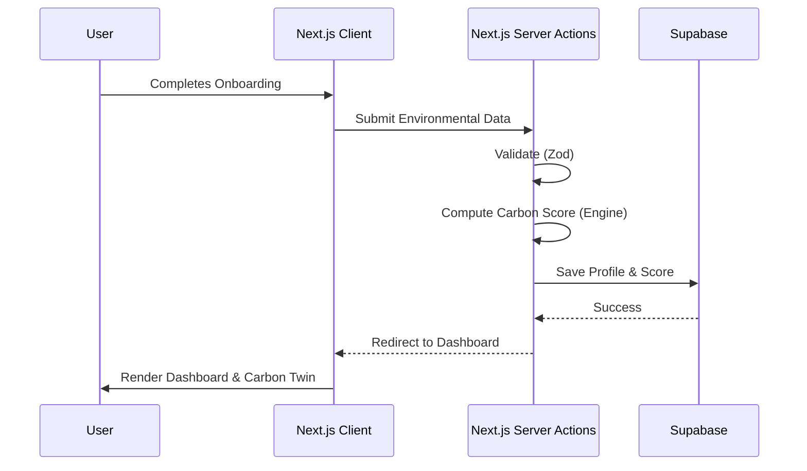

# Architecture & System Design

GreenTrace follows a modular, feature-driven architecture built on top of Next.js App Router.

## High-Level Architecture

```mermaid
graph TD
    Client[Web Client - Next.js React]
    Edge[Vercel Edge Network]
    Auth[Supabase Auth]
    DB[(Supabase PostgreSQL)]
    Analytics[Analytics Engine]

    Client -->|HTTPS/REST| Edge
    Edge -->|SSR / Server Actions| DB
    Client -->|JWT Token| Auth
    Edge -->|Events| Analytics

    subgraph Core Features
        UI[Premium UI Components]
        Sim[Carbon Twin Simulator]
        Gamify[Gamification & Challenges]
    end

    Client --> Core Features
```

## Application Flow



## Technical Decisions
- **Next.js (App Router):** Chosen for optimal SEO, server-side rendering, and seamless API integration via Server Actions.
- **TypeScript:** Enforces strict type safety across the domain, crucial for accurate calculation models.
- **Supabase:** Provides highly scalable, secure PostgreSQL with built-in row-level security (RLS) and authentication.
- **Framer Motion:** Used to create the premium, micro-interactive feel that distinguishes GreenTrace from static calculators.
